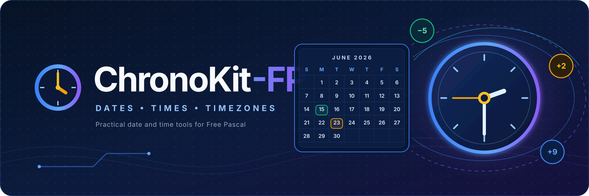

# 📅 ChronoKit-FP: Toolkit for Dates & Times in Free Pascal

[](https://opensource.org/licenses/MIT)
[](https://www.freepascal.org/)
[](https://www.lazarus-ide.org/)


[](CHANGELOG.md)

[](docs/)
[](https://github.com/ikelaiah/chronokit-fp/actions/workflows/test.yml)
[]()

ChronoKit-FP is a lightweight toolkit designed to make date and time handling in Free Pascal easier for everyone. Whether you're calculating business days, handling timezones, or formatting dates, ChronoKit-FP offers practical tools to simplify your work.

```pascal
// Get today's date and add 5 business days
var
  Today, NextWeek: TDateTime;
begin
  Today := TChronoKit.GetToday;
  NextWeek := TChronoKit.AddBusinessDays(Today, 5);
  WriteLn('Next workday: ',
    TChronoKit.FormatDateTime(NextWeek, 'yyyy-mm-dd'));
end;
```

## 🌟 Why ChronoKit-FP?

ChronoKit-FP is a cross-platform date and time library for Free Pascal developers. If you've ever struggled with timezone handling or needed better date manipulation tools, ChronoKit-FP has you covered. It gives you everything you need to work with dates, times, and timezones in your Free Pascal applications.

**Key Features:**

- 🌍 **Cross-Platform Timezone Support** - Works on Windows and Linux
- ⏰ **50+ DateTime Functions** - Everything you need for date/time work
- 💼 **Business Calendars** - Configure holidays and alternative working weeks
- 🎯 **Simple API** - Clean, easy-to-use function names
- 🧪 **Well Tested** - 178 tests cover the supported behavior by domain
- 📚 **Good Documentation** - Complete API reference with examples

## 📑 Table of Contents 

- [📅 ChronoKit-FP: Toolkit for Dates \& Times in Free Pascal](#-chronokit-fp-toolkit-for-dates--times-in-free-pascal)
  - [🌟 Why ChronoKit-FP?](#-why-chronokit-fp)
  - [📑 Table of Contents](#-table-of-contents)
  - [💻 Installation (Lazarus IDE)](#-installation-lazarus-ide)
  - [💻 Installation (Source-based projects)](#-installation-source-based-projects)
  - [🚀 Quick Start](#-quick-start)
  - [📚 Documentation](#-documentation)
  - [🗺️ Roadmap](#️-roadmap)
  - [📊 Real-World Examples](#-real-world-examples)
  - [⚠️ Known Limitations](#️-known-limitations)
  - [✅ Testing](#-testing)
  - [🤝 Contributing](#-contributing)
  - [⚖️ License](#️-license)
  - [🙏 Acknowledgments](#-acknowledgments)

## 💻 Installation (Lazarus IDE)

This is the verified Lazarus installation path.

1. Clone the repository:

```bash
git clone https://github.com/ikelaiah/chronokit-fp
```

2. In Lazarus, open the project that will use ChronoKit.
3. Select `Package` → `Open Package File (.lpk)...`, then open
   `packages/lazarus/chronokit_fp.lpk` from the cloned repository.
4. In the package window, select `Compile`, then select `Use` → `Add to
   Project`.
5. Add `ChronoKit` to your project's `uses` clause and build the project.

## 💻 Installation (Source-based projects)

This is the verified command-line installation path. Keep the cloned
repository (or copy its `src/` directory) alongside your project.

1. Clone the repository:

```bash
git clone https://github.com/ikelaiah/chronokit-fp
```

2. Compile your program with ChronoKit's `src` directory on the unit search
   path. On Windows PowerShell:

```powershell
fpc "-FuC:\path\to\chronokit-fp\src" MyProgram.lpr
```

On Linux:

```bash
fpc "-Fu/path/to/chronokit-fp/src" MyProgram.lpr
```

## 🚀 Quick Start

Start with ordinary calendar dates. This complete example creates a date,
formats it, parses a date supplied as text, and adds seven days. It has no
timezone setup or hidden configuration.

```pascal
program FirstChronoKitProgram;

uses
  SysUtils,
  ChronoKit;

var
  CreatedDate, ParsedDate, NextWeek: TDateTime;
begin
  CreatedDate := EncodeDate(2026, 8, 10);
  WriteLn('Created: ', TChronoKit.FormatDateTime(CreatedDate, 'yyyy-mm-dd'));

  ParsedDate := TChronoKit.ParseDateTime('2026-08-10', 'yyyy-mm-dd');
  NextWeek := TChronoKit.AddDays(ParsedDate, 7);

  WriteLn('One week later: ',
    TChronoKit.FormatDateTime(NextWeek, 'yyyy-mm-dd'));
end.
```

The output is deterministic:

```text
Created: 2026-08-10
One week later: 2026-08-17
```

### Find an answer by task

| Question | Start with |
|---|---|
| How do I parse date/time text? | `TChronoKit.ParseDateTime` |
| How do I format a date/time? | `TChronoKit.FormatDateTime` |
| How do I add or subtract a unit? | `TChronoKit.AddDays` and the other `Add*` methods; use a negative amount to subtract |
| How do I measure exact elapsed time? | `TChronoKit.DurationBetween` |
| How do I calculate a working-day deadline? | `TChronoKit.AddBusinessDays` |
| How do I count working dates in a period? | `TChronoKit.BusinessDaysBetween` |
| How do I check whether ranges overlap? | `TChronoKit.RangesOverlap` |
| How do I convert local time to UTC? | `TChronoKit.SystemLocalToTimeZone(Value, 'UTC')` |
| How do I interpret a named-zone clock? | `TChronoKit.TimeZoneToSystemLocal` |
| How do I convert directly between named zones? | `TChronoKit.ConvertBetweenTimeZones` |

Continue with the [executable learning path](docs/Learning-Path.md) for the
preferred concepts in order, or use the [decision guides](docs/Decision-Guides.md)
when choosing a type, operation, or error response. The [searchable API
reference](docs/API-Reference.md) and [cheat sheet](docs/Cheat-Sheet.md) provide
the complete preferred-method index. The
[v1.6-to-2.0 migration guide](docs/MIGRATION-v1.6-to-v2.0.md) covers every
deprecated 1.x name; all remain source-compatible until 2.0.

Use `TChronoKit.GetToday` when you need the current date at midnight and
`TChronoKit.GetNow` when you need the current local date and time. A
`TDateTime` value does not retain a timezone name: a date is conventionally a
`TDateTime` at midnight, a local date/time is a wall-clock value from the
computer, and `SystemLocalToTimeZone` converts that system-local value to an
explicit target timezone while preserving the instant. `UTC` is the only identifier
guaranteed on Windows and Linux; other identifiers use each platform's native
naming system. ChronoKit uses the supplied date and the operating system's
rules, and raises `ETimeZoneError` instead of guessing at a DST gap or overlap.
See the [timezone contract](docs/Timezone-Contract.md) for the full rules.

Configure holidays when a Monday-to-Friday calculation needs local calendar
rules:

```pascal
var
  Calendar: TBusinessCalendar;
  DueDate: TDateTime;
begin
  Calendar := TChronoKit.CreateBusinessCalendar([
    EncodeDate(2026, 8, 10)
  ]);
  DueDate := TChronoKit.AddBusinessDays(
    EncodeDate(2026, 8, 7), 5, Calendar
  );
end;
```

See [Business calendars](docs/Business-Calendars.md) for alternative working
weeks and recipes for deadlines, reporting periods, and date ranges.

Convert a system-local value to UTC with `SystemLocalToTimeZone`. Use
`TimeZoneToSystemLocal` when the input clock belongs to the named zone and the
result should be in the computer's system timezone. Use
`ConvertBetweenTimeZones` when both the source and target zones are named:

```pascal
var
  LocalValue, SystemValue, UTCValue: TDateTime;
  SourceTimeZone: string;
begin
  LocalValue := TChronoKit.GetNow;
  UTCValue := TChronoKit.SystemLocalToTimeZone(LocalValue, 'UTC');
  SystemValue := TChronoKit.TimeZoneToSystemLocal(UTCValue, 'UTC');

  {$IFDEF WINDOWS}
  SourceTimeZone := 'Eastern Standard Time';
  {$ELSE}
  SourceTimeZone := 'America/New_York';
  {$ENDIF}

  UTCValue := TChronoKit.ConvertBetweenTimeZones(
    EncodeDateTime(2024, 1, 15, 9, 30, 0, 0), SourceTimeZone, 'UTC'
  );
  try
    SystemValue := TChronoKit.TimeZoneToSystemLocal(
      EncodeDateTime(2024, 3, 10, 2, 30, 0, 0),
      SourceTimeZone
    );
  except
    on E: ETimeZoneError do
      WriteLn('The named local time cannot identify one instant: ', E.Message);
  end;
end;
```

### 📅 DateTime Operations

```pascal
program ChronoKitDemo;
uses
  ChronoKit, SysUtils;

var
  CurrentTime, NextWorkday: TDateTime;
  TZInfo: TTimeZoneInfo;
  BusinessHours: TDateTimeRange;
  OffsetSign: string;
begin
  // Basic date/time operations
  CurrentTime := TChronoKit.GetNow;
  NextWorkday := TChronoKit.NextBusinessDay(CurrentTime);
  
  WriteLn('Current time: ',
    TChronoKit.FormatDateTime(CurrentTime, 'yyyy-mm-dd hh:nn:ss'));
  WriteLn('Next workday: ',
    TChronoKit.FormatDateTime(NextWorkday, 'yyyy-mm-dd'));
  
  // Business hours check (9 AM - 5 PM)
  BusinessHours := TChronoKit.CreateRange(
    TChronoKit.StartOfDay(CurrentTime) + EncodeTime(9, 0, 0, 0),
    TChronoKit.StartOfDay(CurrentTime) + EncodeTime(17, 0, 0, 0)
  );
  
  if TChronoKit.RangeContains(BusinessHours, CurrentTime) then
    WriteLn('✅ Within business hours')
  else
    WriteLn('❌ Outside business hours');
    
  // Timezone information
  TZInfo := TChronoKit.GetSystemTimeZoneInfo(CurrentTime);
  if TZInfo.Offset >= 0 then
    OffsetSign := '+'
  else
    OffsetSign := '-';
    
  WriteLn('Timezone: ', TZInfo.Name, ' (UTC', OffsetSign, IntToStr(Abs(TZInfo.Offset) div 60), ')');
  WriteLn('DST active: ', BoolToStr(TZInfo.IsDST, 'Yes', 'No'));
end.
```

### Dependencies

- Windows / Linux
  - No external dependencies required
- Uses only standard Free Pascal RTL units

### Build Requirements

- Free Pascal Compiler (FPC) 3.2.2+
- Lazarus 4.0+ (for compiling example projects and test suites)
- Git for version control

## 📚 Documentation

For detailed documentation, check out:

- 🚀 [Getting Started](docs/Getting-Started.md) - First installation and date operations
- 🎓 [Learning Path](docs/Learning-Path.md) - Five executable concepts from dates through DST
- 🧭 [Decision Guides](docs/Decision-Guides.md) - Choose types, operations, and error responses
- 🔎 [Generated API Reference](docs/API-Reference.md) - Public preferred declarations and contracts
- 🛠️ [Troubleshooting](docs/Troubleshooting.md) - Search paths, formats, and platforms
- 💼 [Business Calendars](docs/Business-Calendars.md) - Holidays, working weeks, and recipes
- 🌐 [Timezone Contract](docs/Timezone-Contract.md) - Identifiers, conversion semantics, and DST failures
- 📋 [Searchable API Cheat Sheet](docs/Cheat-Sheet.md) - Find operations by question, synonym, or method
- 📖 [Task Guide](docs/ChronoKit-FP.md) - Behavior, choices, and examples grouped by task
- 🔎 [v1.7.0 API Audit](docs/API-Audit-v1.7.0.md) - Reproducible beginner discovery findings and actions
- 🧭 [2.0 Decision](docs/V2-DECISION.md) - Evidence and criteria for a future major version
- 🔁 [v1.6-to-2.0 Migration](docs/MIGRATION-v1.6-to-v2.0.md) - Every deprecated name and its replacement
- 🏗️ [Internal Architecture Decision](docs/decisions/0001-domain-internals.md) - Domain ownership, dependency direction, and timezone-backend rationale
- 🤝 [Contributor Guide](CONTRIBUTING.md) - Where implementation, tests, contracts, and examples belong

## 🗺️ Roadmap

See the [roadmap through 2.0.0](ROADMAP.md) for planned usability and
cross-platform improvements.

## 📊 Real-World Examples

You can use ChronoKit-FP to build all kinds of applications:

| Example Project | Description | Source Code |
|-----------------|-------------|-------------|
| ChronoKit Example | Demonstrates the library's capabilities with practical use cases | [View Example](examples/ChronoKitExample/) |
| Add Business Days | Calculate next business day, accounting for weekends and holidays | [View Example](examples/AddBusinessDays/) |
| Quick Start Demo | Creates, formats, parses, and adds calendar dates | [View Example](examples/ChronoKitQuickStart/) |

## ⚠️ Known Limitations

- **Platform Support**: Currently works on Windows 11 and Ubuntu 24.04.
- **Timezone Database**: Linux systems need timezone data installed (usually comes with most distributions).
- **Timezone handling**: `UTC` is portable; IANA and Windows identifiers are
  platform-native. Keep the timezone name beside every `TDateTime` whose zone
  must be known later, and handle `ETimeZoneError` at DST discontinuities or
  when platform timezone data is unavailable.

## ✅ Testing

Run the test suite from the command line with Free Pascal 3.2.2+. In PowerShell
on Windows:

```powershell
cd tests
$sourcePath = (Resolve-Path ../src).Path
fpc "-FU." "-Fu$sourcePath" TestRunner.lpr
.\TestRunner.exe -a --format=plain
```

On Linux:

```bash
cd tests
fpc "-FU." "-Fu$(pwd)/../src" TestRunner.lpr
./TestRunner -a --format=plain
```

The runner registers 178 tests across nine domain suites for date basics,
parsing, business calendars, periods and durations, ranges, rounding, calendar
systems, timezones, and legacy behavior. Pull requests compile and run the same
suite automatically on Windows and Linux.

Release documentation and both frozen platform API manifests can be checked
from PowerShell:

```powershell
pwsh -NoProfile -File tools/TestDocumentation.ps1
```

Source-based and Lazarus-package consumers can be verified without relying on
compiled units from the working checkout:

```powershell
pwsh -NoProfile -File tools/TestCleanConsumers.ps1
```

## 🤝 Contributing

Want to help out? Great! Feel free to submit a Pull Request. For big changes, please open an issue first so we can chat about it.

1. Fork the Project
2. Create your Feature Branch (`git checkout -b feature/AmazingFeature`)
3. Commit your Changes (`git commit -m 'Add some AmazingFeature'`)
4. Push to the Branch (`git push origin feature/AmazingFeature`)
5. Open a Pull Request

## ⚖️ License

This project is licensed under the MIT License - see the [LICENSE](LICENSE.md) file for details.

## 🙏 Acknowledgments

- [Free Pascal Dev Team](https://www.freepascal.org/) for the Free Pascal compiler
- [Lazarus IDE Team](https://www.lazarus-ide.org/) for such an amazing IDE
- [Inkscape developers and contributors](https://inkscape.org/) for creating and maintaining an excellent open-source graphics editor, which helped me edit and refine the project logos and banner
- The helpful folks in various online communities:
  - [Unofficial Free Pascal Discord server](https://discord.com/channels/570025060312547359/570091337173696513)
  - [Free Pascal & Lazarus forum](https://forum.lazarus.freepascal.org/index.php)
  - [Tweaking4All Delphi, Lazarus, Free Pascal forum](https://www.tweaking4all.com/forum/delphi-lazarus-free-pascal/)
  - [Laz Planet - Blogspot](https://lazplanet.blogspot.com/) / [Laz Planet - GitLab](https://lazplanet.gitlab.io/)
  - [Delphi Basics](https://www.delphibasics.co.uk/index.html)
- Everyone who has helped make this project better
